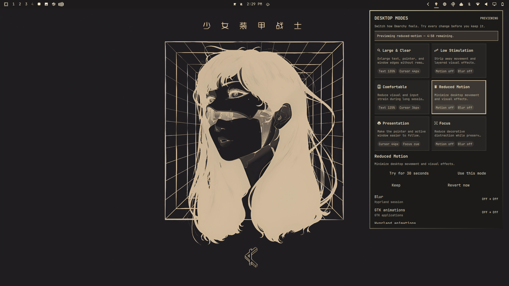

# Desktop Modes for Omarchy

Switch Omarchy into the mode you need now—clearer, calmer, presentation-ready,
or distraction-free. Try every change first, keep it with one click, and return
to your exact original settings whenever you want.

Desktop Modes is a local-only Quickshell plugin for Omarchy 4.x. It groups
carefully scoped Hyprland and GTK settings into six explainable modes:
Large & Clear, Low Stimulation, Comfortable, Reduced Motion, Presentation, and Focus. Every preview and apply
is read back, state is kept outside the checkout, and restore detects changes
made by another tool before touching them. The repository includes the
marketplace manifest, license, and preview asset used for publication.



## Pick the moment, then the mode

| When you need… | Try… | What changes |
| --- | --- | --- |
| Larger, easier-to-track UI | **Large & Clear** | Text, cursor, zoom, and borders |
| A calmer desktop | **Low Stimulation** | Motion, blur, shadows, and dimming |
| Less strain during a long session | **Comfortable** | Readability, pointer, motion, and keyboard repeat |
| Minimal movement | **Reduced Motion** | Hyprland and GTK motion effects |
| A pointer people can follow on a call | **Presentation** | Cursor and active-window emphasis |
| Fewer decorative distractions | **Focus** | Effects off and inactive windows dimmed |

Choose a 30-second test, a 5-minute trial, or a 25-minute focus session. Timed
sessions revert automatically even when the panel is closed.

## Install

Plugins run as unsandboxed code inside `omarchy-shell`; inspect this repository
before enabling it.

```sh
omarchy plugin add https://github.com/EF-Code/omarchy-desktop-modes.git --enable
omarchy bar move io.github.ef-code.desktop-modes --section right
```

Open the Desktop Modes icon, select a mode, review the plan, and choose **Try** or
**Use this mode**. A trial has explicit **Keep** and **Revert now** actions.
The first preview or apply captures the original value for each setting Access
actually manages. Later profile switches add only their newly managed settings
to that baseline. Restore leaves settings Desktop Modes never changed alone, restores
safe entries even when another entry has external drift, and keeps conflicts
pending until you resolve them. The panel presents **Keep external** and
**Restore original** for each conflict. While a preview or conflict is pending,
new profile mutations are blocked.

## Make a mode yours

Select any mode and choose **Make this mode yours**. The plugin saves a validated
copy under `${XDG_CONFIG_HOME:-$HOME/.config}/omarchy-desktop-modes/profiles.json`.
Custom modes can contain only the same registered, typed, bounded settings as
the built-ins; names and descriptions cannot introduce commands or paths.

Advanced users can edit that JSON directly. Reload the panel after saving. An
invalid file fails closed and no desktop setting is changed.

## Keyboard and quick access

Inside the panel, use arrow keys to move between modes, `P` to try one, `A` to
apply it, `R` to return to Original, and `Escape` to close. You can also invoke
the existing IPC from a Hyprland binding or launcher:

```sh
omarchy-shell io.github.ef-code.desktop-modes applyProfile focus
omarchy-shell io.github.ef-code.desktop-modes applyProfile presentation
omarchy-shell io.github.ef-code.desktop-modes restore
```

Right-clicking the bar icon opens the guarded Return to Original flow.

## Restore before removal

Always choose **Restore original settings** and resolve any conflicts before removing
the plugin. Omarchy plugins have no uninstall hook, so removal cannot restore
settings automatically.

```sh
omarchy plugin remove io.github.ef-code.desktop-modes
```

If the panel is unavailable while the checkout still exists, inspect the state
and run the helper with a fresh operation ID:

```sh
~/.config/omarchy/plugins/io.github.ef-code.desktop-modes/scripts/desktop-modesctl status
~/.config/omarchy/plugins/io.github.ef-code.desktop-modes/scripts/desktop-modesctl restore \
  --operation-id "$(uuidgen)"
```

The baseline is stored at
`${XDG_STATE_HOME:-$HOME/.local/state}/omarchy-desktop-modes/baseline.json`.
The helper refuses unsafe XDG paths and state-file symlinks. Manual recovery
should be performed only after inspecting that file and the live values.

## Supported settings

| Setting | Surface | Timing |
| --- | --- | --- |
| Hyprland animations, blur, shadows, dimming, borders | Hyprland session | Immediate |
| Cursor zoom | Hyprland compositor | Immediate |
| Keyboard repeat rate and delay | Hyprland input | Immediate |
| GTK animation preference, text scale, cursor size | GTK applications honoring the schema | Immediate or new app |

Support is probed at runtime. `Supported`, `Already set`, `Unavailable`,
`Dependency unavailable`, and `Probe error` are shown separately; unsupported
optional settings do not make a profile pretend to be complete. Monitor scaling
and screen-reader support are intentionally out of scope.

## Privacy and security

The plugin has no network dependency, account, telemetry, or privileged path.
It runs unsandboxed inside `omarchy-shell` with the installing user’s
permissions. QML invokes one local helper with those same permissions. Profile data can
contain only registered setting IDs and typed bounded values; it cannot carry
commands or configuration paths. The helper uses argument arrays, a short
`flock`, atomic state writes, a pending-operation journal, verified rollback,
and a bounded local history. Diagnostics omit usernames, home paths, window
titles, command history, and application content.

The write-ahead journal records only settings an operation may have reached and
is retained until state is committed. Recovery rolls back incomplete writes but
does not undo a committed operation. Preview reverts preserve values changed by
another tool while the preview was active.

GTK settings do not affect every Qt, Electron, browser, or already-running
application. Cursor behavior varies by toolkit. Profiles leave omitted
settings alone. Hardware, geometry, focus, and multi-monitor behavior must be
validated on the target Omarchy session; static checks do not prove those
paths.

## Development

```sh
omarchy plugin validate .
qmllint -I "${OMARCHY_PATH:-/usr/share/omarchy}/shell" \
  BarWidget.qml Panel.qml Service.qml components/*.qml
bash tests/run.sh
node tests/model.test.js
bash tests/repository-check.sh
```

For a safe backend-only run, set `DESKTOP_MODESCTL_MOCK_DIR` to an absolute temporary
directory. The mock adapter never changes the live desktop. The test suite also
includes a Bats file; use Bats 1.14 or newer when running `tests/desktop-modesctl.bats`.

## Roadmap

- Fine-grained custom-mode controls for every allowlisted setting.
- Optional, visible triggers for external displays and screen sharing.
- Import/export with an explicit review step before a shared mode is saved.
- More toolkit coverage where changes can remain local and reversible.

Requests are welcome, especially when they describe the situation a mode should
help with rather than only naming a desktop setting.

## License

MIT. See [LICENSE](LICENSE).
